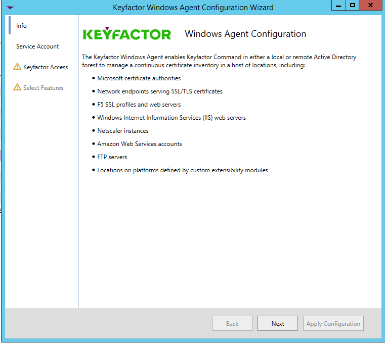
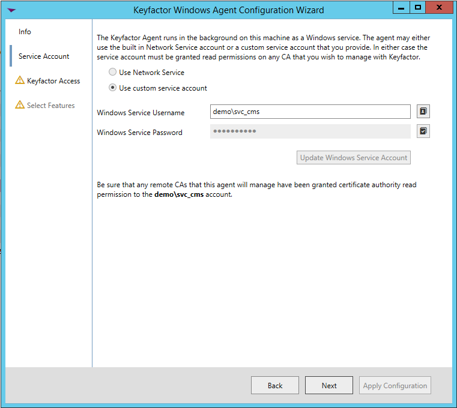

# Windows Certificate Store Orchestrator 
## Overview
The Windows Certificate Store Orchestrator allows a user to inventory, add, and remove certificates from arbitrary Windows Local Machine certificate stores. 

## Configuration

**1. In Keyfactor Command begin by creating a new Certificate Store type similar to the one below:**

#### STORE TYPE CONFIGURATION
CONFIG ELEMENT	| DESCRIPTION
---------------------|------------------
Name	|Descriptive name for the Store Type
Short Name	|The short name that identifies the registered functionality of the orchestrator. Must be **WinCerMgmt**
Needs Server	|Must be checked
Blueprint Allowed	|Unchecked
Requires Store Password	|Determines if a store password is required when configuring an individual store.  This must be unchecked.
Supports Entry Password	|Determines if an individual entry within a store can have a password.  This must be unchecked.
Supports Custom Alias	|Determines if an individual entry within a store can have a custom Alias.  This must be Forbidden.
Uses PowerShell	|Unchecked
Store Path Type	|Determines what restrictions are applied to the store path field when configuring a new store.  This can be Freeform or Multiple Choice. Multiple Choice will allow the administrator the ability to limit the Certificate Stores that can be managed by the orchestrator. 
Store Path Value|A comma separated list of options to select from for the Store Path. This configuration option is only available with Mulitple Choice Store Path Type. 
Private Keys	|This determines if Keyfactor can send the private key associated with a certificate to the store.  This should be configured as Optional to allow for the management of certificate with and without a private key. 
PFX Password Style	|This determines how the platform generate passwords to protect a PFX enrollment job that is delivered to the store.  This can be either Default (system generated) or Custom (user determined).
Job Types	|Inventory, Add, and Remove are the supported job types. 
Parameters	|The following optional configuration parameters are supported. Any parameters defined here will be populated with the appropriate data when creating a new certificate store. <table><tr><th>Parameter Name</th><th>Parameter Type</th><th>Default Value</th><th>Required</th></tr><tr><td>spnwithport</td><td>Boolean</td><td>false</td><td>No</td></tr></table>

    **Parameters:**

    - **SPN with Port** - Optional. Determine if the SPN assoicated with the remote connection contains the connection's port number (5985). Default is &quot;false&quot;.

**2. Register the Windows Certificate Store Orchestrator with Keyfactor Command**

Open the Keyfactor Windows Agent Configuration Wizard and perform the tasks as illustrated below:

- Click **\<Next\>**

- If you have configured the agent service previously, you should be able to skip to just click **\<Next\>.** Otherwise, enter the service account Username and Password you wish to run the Keyfactor Windows Agent Service under, click **\<Update Windows Service Account\>** and click **\<Next\>.**

- If you have configured the agent service previously, you should be able to skip to just re-enter the password to the service account the agent service will run under, click **\<Validate Keyfactor Connection\>** and then **\<Next\>.**

- Select the agent you are adding capabilities for (in this case, IIS With Binding, and also select the specific capabilities (Inventory and Management in this example). Click **\<Next\>**.

- For each AnyAgent implementation, check **Load assemblies containing extension modules from other location** , browse to the location of the compiled AnyAgent dll, and click **\<Validate Capabilities\>**. Once all AnyAgents have been validated, click **\<Apply Configuration\>**.

- If the Keyfactor Agent Configuration Wizard configured everything correctly, you should see the dialog above.
